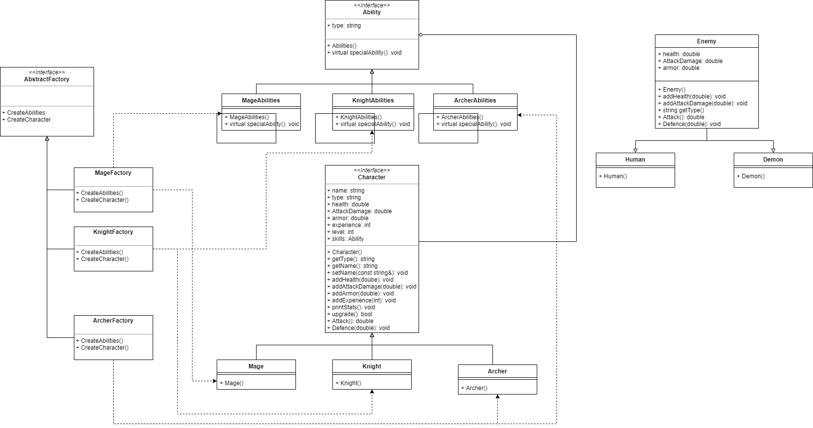
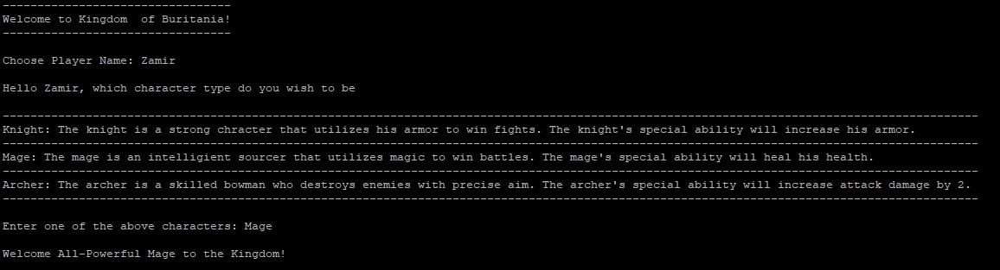
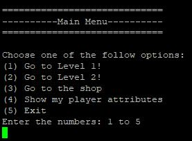
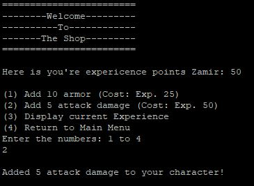
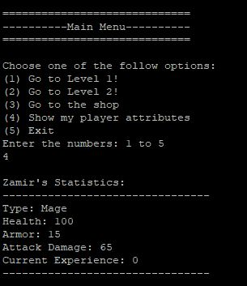
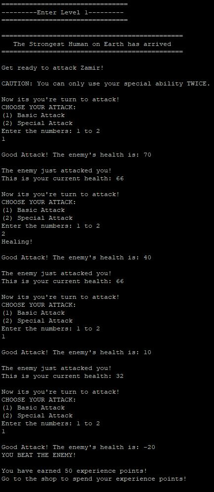
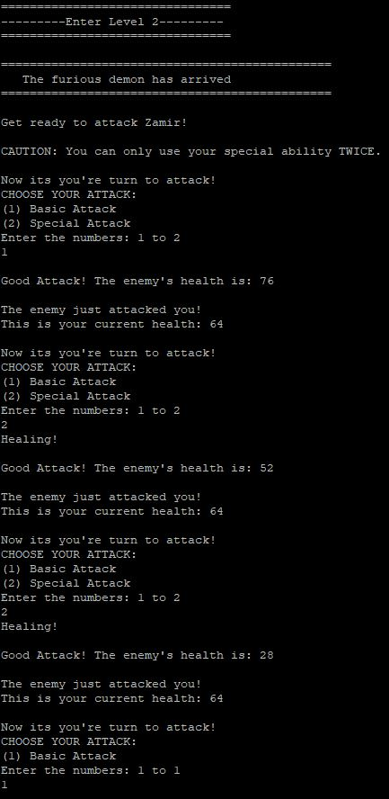
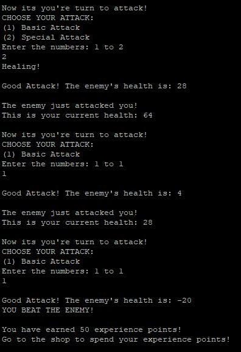

# Kingdom of Buritania
 
> Authors: [Zamir Noor](https://github.com/zzamir102) [Ali Noor](https://github.com/anoor012) [Jeng-Rung Tu](https://github.com/JengRung)

## Project Description
### RPG Details
  * This is going to be a text-based RPG with a fantasy type genre. 
  * We chose to make a Text-Based Role-Playing Game because it seems very fun and relatable to us. This project idea allows us to be creative such that we are able to tell unique stories and make unique characters through a programming project. 
###  Languages/tools/technologies
* C++ - Programming Language used for our project
* Valgrind - Used to detect memory leaks
* CMake - to compile various file in our program
* Google Framework - helps create unit tests for code
###  Input/Output
* Input: Keyboard prompts for choosing character/level
* Output: Console outputs corresponding to specific inputs
### Design Patterns
#### Abstract Factory Pattern
* We picked the Abstract Factory patttern because it allows us to create families of objects. This is important to our RPG, since we will need to make different types of characters. These unique characters can make their own unique family, which is distinguished by certain characteristics such as their ability or weapons. Some problems we might encounter is inheritance and how classes will work together. Another issue that branches from this issue is organization of the classes we create. The Abstract Factory Pattern will be a great solution for this problem because it has the structure and interface for the abundance of classes/objects we are going to create.   
#### Strategy Pattern
* The second pattern we considered is the strategy pattern. We chose this pattern because it lets us create different attacks for the characters in our RPG. An issue we might encounter in our project is the creation of multiple attack functions, which consequently requires us to modify our classes. The strategy pattern will be a great solution for this problem because we can continuously add different strategies to attack without modifying our class. The strategy pattern allows us to branch out from a class to a interface that supports the creation of multiple strategies. This pattern will allow us to continuously add new attack strategies if time is allotted. 

## Class Diagram

### Class Diagram Description
* The above diagram depicts our classes organized in the Abstract Factory Pattern and the Strategy Pattern.
* The Character class is an interface for the three different type of characters we are creating. The Character class provides all necessary getters and setters, so that the subclasses can be simply a constructor with certain values for damage, health, etc. 
* The Ability class is an interface for the abilities that the characters will possess respectively. The the subclasses of the Ability class will have a virtual function that will implement a strategy pattern. This will allow the player of the RPG to have a variety of choices when it comes to their abilities. The multiple boxes below the MageAbility, KnightAbility, and ArcherAbility classes represent the creation of different strategies for each type of ability.
* The Enemy class is a seperate class that the client code mainly uses. This class is the interface for the different type of enemies that the player must battle against in the RPG. The Human and Demon class inherent from the Enemy class, so that repetition can be avoided and different types of enemies can be created. 
* The AbstractFactory class is the interface for the following classes: MageFactory, ArcherFactory, and KnightFactory. The three different factories create three families of characters. For example, the MageFactory's job is to create a Mage object and a MageAbility object. This same procedure is done with the ArcherFactory class and the KnightFactory class. The client code uses this factory to simplify the creation of different characters at runtime.  
 
 ## Screenshots
  ### Character Selection
   * The first part of the game is character selection. The game first prompts the player to choose the name of their character and then asks for the type of character they would like to play!
   
  ### Main Menu
   * The main menu will allow the player to traverse through the different aspects of the game. \
       
  ### Shop
   * The player receives experience points when completing levels of the game! With these experience points the player can upgrade their attributes in the shop! \
       
  ### Printing Character Stats
   * The player has an option in the menu to print out their character's attributes! \
       
  ### Level 1
   * Level 1 of the game is very easy! You are tasked with defeating the most powerful HUMAN! \
      
  ### Level 2
   * Level 2 of the game is very difficult compared to the first level. You might need to complete level 1 multiple times in order to make your character strong enough to defeat the DEMON! \
      
      
  
 ## Installation/Usage
 * To play the RPG we created, please clone this repository into a linux CLI environment that is able to use cmake. After cloning the repository, simply run cmake3. and then make in the terminal. This will compile the code in our program. To start playing the actual game you will need to type "./main". 
 ## Testing
 * This project is tested/validated by the test benches we created in our test folder. These tests are using the Google unit test framework in order to validate the result of our various functions. 
 * We mainly tested the functions that we created in our classes. Each class has its own test file, and each function of that class is tested for correctness in its return value or functionality. The client code is tested by our group members individually. 
 * We run the client code and play the game to see if the game is running how it is supposed to be running. The main test that we are running in our main.cpp is valgrind memory leak tests. We use the valgrind memcheck framework everytime we execute main to be sure of no memory leaks. 
 
